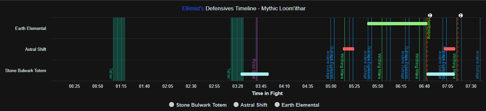

# Elli's WCL Components

## Available Components

### Defensives Timeline
**File:** `components/common/DefensivesTimeline.ts`

A comprehensive timeline visualization showing defensive ability usage and encounter mechanics for individual players.

**Features:**
- Shows defensive ability duration bars (buffs/cooldowns)
- Displays encounter-specific reference casts as vertical lines
- Includes death markers with player names
- Automatically detects encounter and shows relevant boss abilities
- Supports time window filtering
- Player-specific damage event filtering

**Usage:**
- Best used when viewing a single player
- Automatically adapts to the selected encounter (Loomithar, etc.)



**Key Information Displayed:**
- Horizontal bars: Active defensive abilities (Stone Bulwark Totem, Astral Shift, etc.)
- Vertical colored lines: Boss abilities and mechanics
- Red dashed lines: Player deaths
- Timeline respects current fight time window

---

### Defensives Used
**File:** `components/common/DefensivesUsed.ts`

A detailed breakdown of defensive ability usage with player and ability counts.

**Features:**
- Lists all players and their defensive ability usage
- Groups by class with color-coded player names
- Shows total cast counts per player
- Sortable by total defensive usage

<!--  -->

**Key Information Displayed:**
- Player names with class coloring
- Individual ability usage counts
- Total defensive casts per player
- Organized by class groups

---

### Defensives Used Table (WIP)
**File:** `components/common/DefensivesUsedTable.ts`

A tabular view of defensive ability usage across all players.

**Features:**
- Table format showing players vs abilities
- Easy comparison of defensive usage patterns
- Class-based organization
- Ability-specific columns

<!--  -->

**Key Information Displayed:**
- Rows: Players (grouped by class)
- Columns: Defensive abilities used
- Cells: Number of times each ability was used
- Total column showing overall defensive activity

---

## Setup and Development

### Prerequisites
- Node.js (v16 or higher)
- NPM or Yarn package manager

### Installation
```bash
npm install
```

### Configuration
Component settings can be customized in `template.config.js`:

```js
module.exports = {
    components: {
        defensivesTimeline: {
            w: 4,  // Width in grid units
            h: 2   // Height in grid units
        }
    }
}
```

### Encounters Module
New encounters can be added in the `encounters/` directory:

1. Create encounter data file (e.g., `encounters/raid/newBoss.ts`)
2. Define mechanics with spell IDs and display properties
3. Add encounter mapping in `encounters/index.ts`

Example encounter structure:
```typescript
export const NewBossEncounter: EncounterData = {
    name: "New Boss",
    encounterId: 1234,
    mechanics: {
        majorAbility: {
            name: "Major Ability",
            events: {
                cast: {
                    spellId: 56789,
                    eventType: 'cast',
                    usageHints: {
                        plotImportance: 'primary',
                        defensiveTiming: 'proactive'
                    },
                    display: {
                        color: '#FF0000',
                        text: 'Major Hit'
                    }
                }
            }
        }
    }
};
```

### Defensive Abilities
Defensive abilities are configured in `definitions/defensives.ts` by class:

```typescript
"Shaman": {
    "108270": {
        "name": "Stone Bulwark Totem",
        "duration": 30000,
        "cooldown": 120000
    }
}
```

### Development
Automated testing uses Puppeteer to validate components:

```bash
npm run dev
```

### Development
To enable hot reload for rapid development, you can leverage the autotest plugin which uses Puppeteer.

First, add your WCL login credentials to `.env` 
```js
WCL_LOGIN_EMAIL=yourSecretsHere
WCL_PASSWORD=yourSecretsHere
// or
BNET_LOGIN_EMAIL=yourSecretsHere
BNET_PASSWORD=yourSecretsHere
```
Configure login method settings in `template.config.js`:
```js
plugins: {
    autoTest: {
        active: true,
        loginMethod: "WCL",
        // components...
    }
}
```

## File Structure

```
├── components/
│   ├── common/           # Universally relevant components
│   └── encounterSpecific/# Encounter-specific components
├── encounters/           # Encounter data and mechanics
├── definitions/         # Type definitions and configurations
├── dist/               # Compiled components (auto-generated)
└── template.config.js  # Build and test configuration
```

## Import Strings

Each component generates an import string for use in Warcraft Logs:
- `.component.js` - Compiled JavaScript
- `.import.txt` - Base64 import string for WCL
- `.lzstring.txt` - Compressed source code

Copy the content from `.import.txt` to import components into WCL.

## Additional Resources

- [WCL Scripting API Documentation](https://www.warcraftlogs.com/scripting-api-docs/warcraft/modules/RpgLogs.html)
- [Report Components Help Articles](https://articles.warcraftlogs.com/help/what-are-report-components)
- [WCL Discord](https://discord.gg/5ebPJSsy5y) for component development support
- [Component Alpha Signup](https://forms.gle/oFcWCMbgqDK2j2e69)

## Contributing

1. Fork the repository
2. Create feature branch: `git checkout -b feature/new-component`
3. Commit changes: `git commit -am 'Add new component'`
4. Push to branch: `git push origin feature/new-component`
5. Submit pull request
